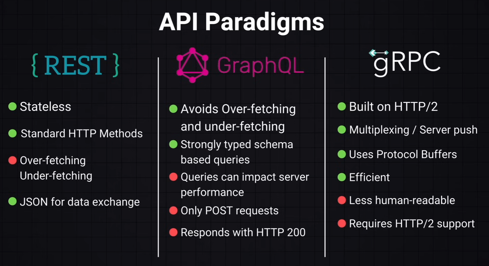

# API Design

## Contents

- API Paradigms
- REST
- Best Practices

## API Paradigms

## Rest APIs

- `GET` to fetch data.
  - `/api/resource`
- `POST` to create data
  - `/api/resource`
- `PUT` to update an entire resource
  - `/api/resource/:id`
- `PATCH` to partially update a resource
  - `/api/resource/:id`
- `DELETE` to delete a resource
  - `/api/resource/:id`

## Best Practices

### Backward compatibility and Versioning

It is important to maintain backward compatibility when modifying endpoints.
A common practice for REST is to release a new API version.
In the case of GraphQL you can add new fields (like `_v2`) without removing the old one in the API.

### Rate Limiting

This can protect the API from DDOS attacks, controlling the number of requests a user/ip can make in certain timeframe.

### CORS

Cross Origin Resource Sharing allows you to control which domains can access your API, preventing cross-site interactions.
