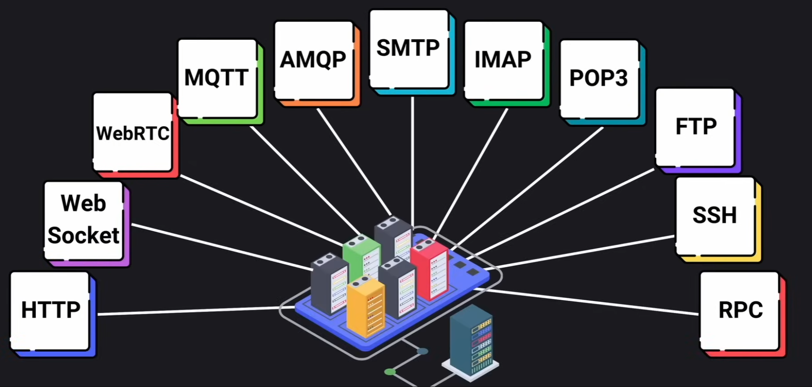

# Application Level Protocols

In this section we'll go over some of the most commonly used application level protocols.

## Contents

- [HTTP](#http)
- [WebSockets](#websockets)
- [Email Related Protocols](#email-related-protocols)
- [File Transfer Protocols](#file-transfer-protocols)
- [Real-time Communications](#real-time-communications)
- [RPC](#rpc)

## HTTP

Hyper Text Transfer Protocol

- Built on TCP/IP
- Request-Response protocol (no memory)

### Status Codes

- `2XX` Success Codes
  - `200` Ok
  - `201` Created
  - `204` No content
- `3XX` Redirection Codes
  - `301` Moved permanently
  - `302` Found but temporarily in another URI
  - `304` Not Modified - Cached version is still valid
- `4XX` Client Error Codes
  - `400` Bad Request
  - `401` Unauthorized
  - `403` Forbidden
  - `404` Not Found
  - `429` Too many requests
- `5XX` Server Error Codes
  - `500` Internal Server Error
  - `501` Not Implemented
  - `503` Service Unavailable

### Methods

Most commonly used methods are:

- `GET` to fetch data
- `POST` to create data
- `PUT` to update an entire resource
- `PATCH` to partially update a resource
- `DELETE` to delete a resource

## WebSockets

Two-way communication channel over a single long-lived connection.
It allows servers to "push" real time updates to clients.

## Email Related Protocols

- `SMTP` Email transmission across the internet (Simple Mail Transfer Protocol)
- `IMAP` Used to retrieve emails from a server (Internet Message Access Protocol). Ideal for users who need to access their emails from different devices
- `POP3` Used for downloading emails from a server (Post Office Protocol v3). Typically used when emails are managed from a single device

## File Transfer Protocols

- `FTP` For transfering files over the internet
- `SSH` For command-line login and file transfer

## Real-time Communications

- `WebRTC` Enables browser-to-browser applications for voice calling, video chat and file sharing.
- `MQTT` Lightweight messaging protocol (Message Queuing Telemetry Transport)
- `AMQP` Protocol for message-oriented middleware (Advanced Message Queuing Protocol)

## RPC

Remote Procedure Calls allows a program on one computer to execute code on a server or another computer. It is a method used to invoke a function as if it were a local call, but in reality it is executed on the remote machine.
