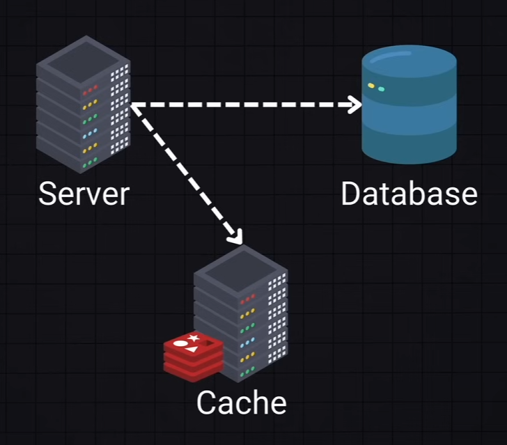
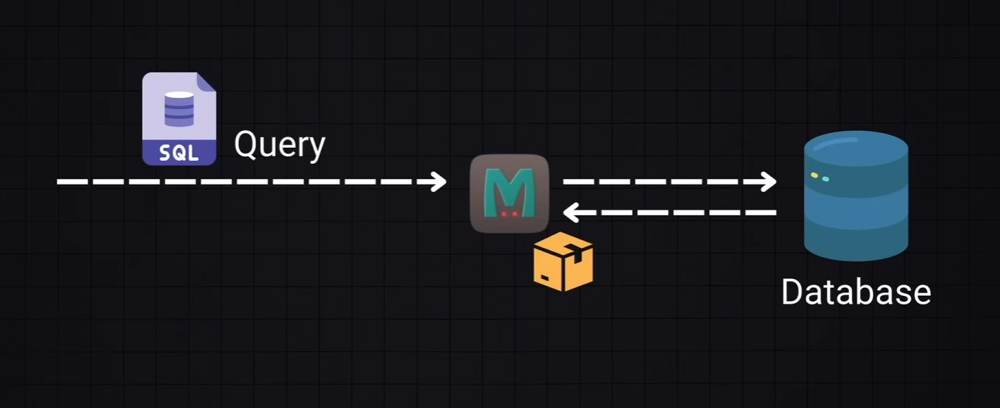
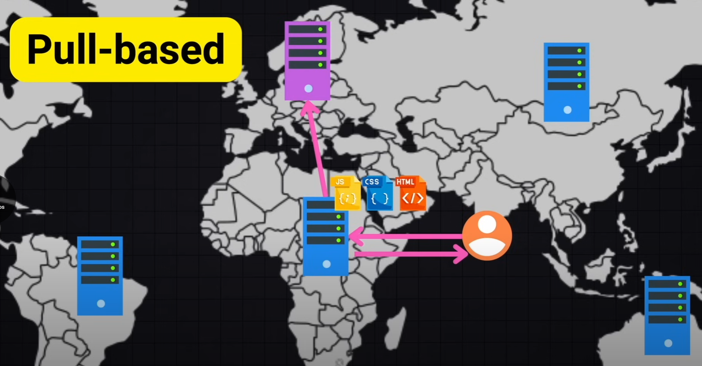
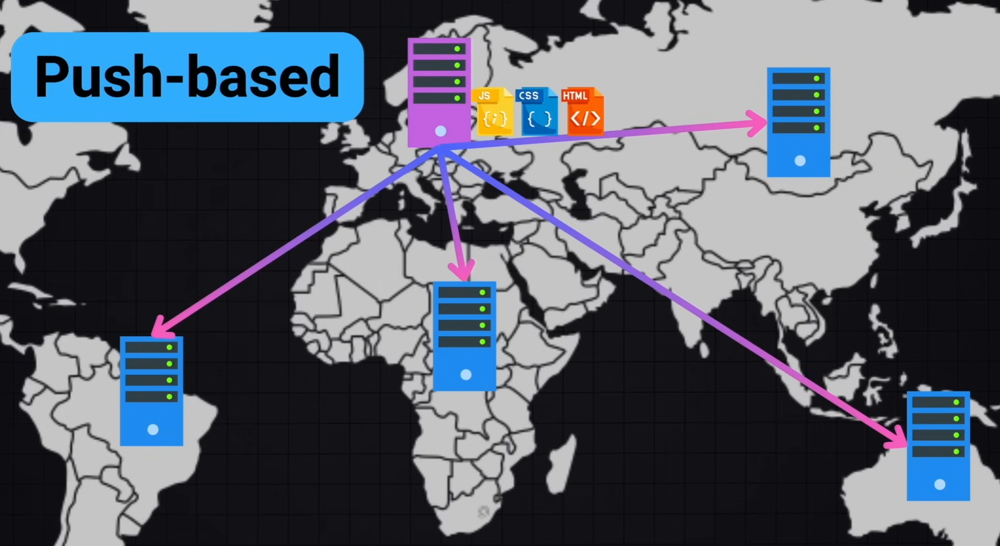

# Caching and CDN

| CDN               | Caching             |
| ----------------- | ------------------- |
| Reduced Latency   | Reduced Latency     |
| High Availability | Lowered Server Load |
| Improved Security | Improved UI         |

## Contents

## Caching

Technique used to improve the performance and efficiency of a system.
It involves storing a copy of data in a temporary storage (cache) so that future requests for that data can be serverd faster.

### Browser Caching

- Browser will store the data in a directory on client's hard drive.
- We use the `cache-control` header to tell browser how long this content should be cached

### Server Caching

- Store frequently accessed data on the server-side to reduce expensive operations (like database queries)
- Typically stored in a separate cache server (like Redis)

- `Write-Around Cache`

  - fetch from cache, otherwise permanent storage, return data, write cache

- `Write-Through Cache`

  - simultaneously write to cache and permanent storage

- `Write-Back Cache`
  - write to cache first, then to permanent storage

#### Eviction Policies

What happens if the cache is full ?
We need to set rules to remove from the cache when it is full.
Common used policies are:

- `LRU` Least recently used
- `FIFO` First In First Out
- `LFU` Lest Frequently Used

### Database Caching

Usually done by the database internally or by an external cache layer like Redis or Memcached

### Content Delivery Networks (CDN)

Generally used to serve static content like HTML, JS, CSS and media files.
They cache the content from the original server and deliver it to users from the neares CDN server.
If the CDN server has the content it will serve it, otherwise it will request it from the original server and cache it.

