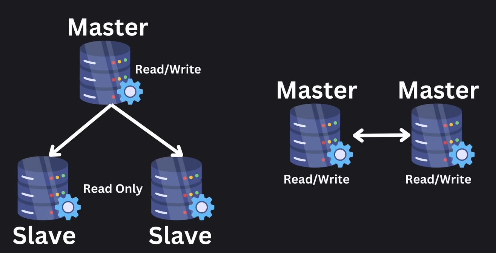
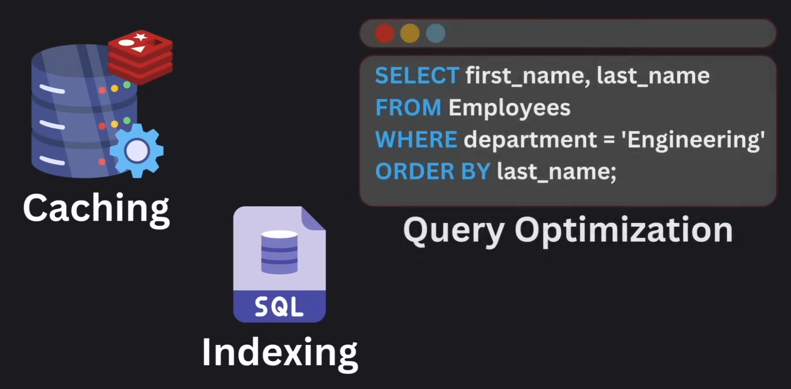

# Databases

## Contents

- [Relational Databases](#relational-databases)
- [NoSQL Databases](#nosql-databases)
- [In-memory Databases](#in-memory-databases)
- [Scaling](#scaling)
- [Performance](#performance)

## Relational Databases

All SQL databases use tables for data storage and use SQL as a query language.
They are great for transactions, complex queries and integrity.

> The most common examples are PostgresQL, MySQL, SQLite, etc.

### A.C.I.D Compliance

- `A`tomicity: transactions are all or nothing
- `C`onsistency: after a transaction your database should be in a consistent state
- `I`solation: each transaction should be independent
- `D`urability: once a transaction is commited the data is there to stay

## NoSQL Databases

These databases drop the `Consistency` property from the `ACID`.
No schemas, good for unstructured data.

There are different types of NoSQL databases:

- `Key-Value Pairs`
- `Document-based`
- `Graph-based`
- `In-memory`

> The most common examples are MongoDB, Cassandra, Redis, etc.

## In-memory Databases

Can be Relational or NoSQL depending on their design and structure.

## Scaling

### Vertical Scaling

- Increasing CPU power
- Adding RAM
- Adding disk storage
- Upgrading network

### Horizontal Scaling

- Sharding
- Replication

#### Sharding

Consists of distributing different portions (shards) of the dataset across multiple servers.

Some of the sharding strategies are:

- `Range-based Sharding`: based on the range of a given key
- `Directory-based Sharding`: Lookup service to direct traffic to the correct node
- `Geographical Sharding`: Based on geographic location

#### Replication

Keeping copy of data in multiple servers for high availability.

- `Master-Slave replication`: strategy where slave instances are only used for READ operations
- `Master-Master replication`: all instances can do WRITE and READ operations

## Performance

Some of the most common techniques to optimize performance are:

- `Caching`: In-memory caching is usually used for frequently accessed data
- `Indexing`: Creating an index for frequently accessed columns will significantly speed up retrieval times
- `Query Optimization`: Optimizing queries for fast data access. i.e. minimizing `JOIN`s and using tools to understand query performance.
