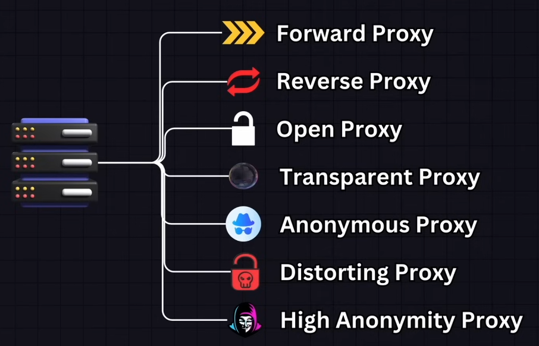
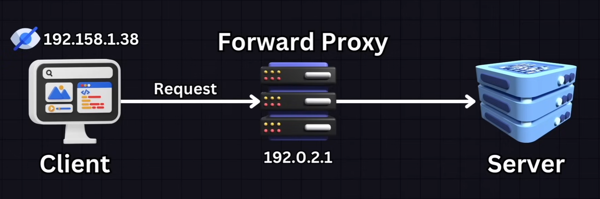
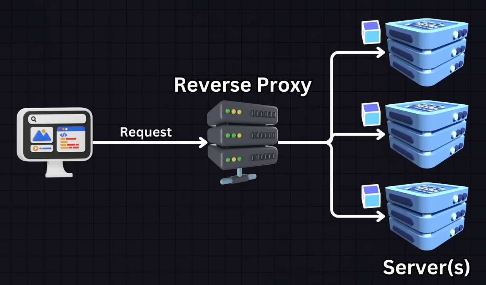

# Proxy Servers

## Contents

- [Types of Proxy Servers](#types-of-proxy-servers)
- [Forward Proxy](#forward-proxy)
- [Reverse Proxy](#reverse-proxy)

## Types of Proxy Servers

- `Forward Proxy`: sits in front of clients and is used to forward requests to other servers on the internet. Often used within internal networks to control internal access
- `Reverse Proxy`: sits in front of one or more webservers, intercepting requests. It is used for load-balancing, web acceleration and as a security layer.
- `Open Proxy`: allows any user to connect and utilize the proxy server. Often used to anonymize web browsing and bypass content restrictions.
- `Transparent Proxy`: passes along requests and resources without modifying then. Often used for content filtering and caching.
- `Anonymous Proxy`: Proxy server that does not make the origin IP address available.
- `Distorting Proxy`: Purposedly missinforms the origin IP
- `High Anonymity Proxy`: **Also called Elite Proxy**. These proxies do not send any identifying headers and are used for the maximum possible anonymity.

## Forward proxy

### Common use cases

- **Instagram Proxies**: allows the use of multiple instagram accounts without triggering restrictions/suspicion.
- **Internet User Control**: some organizations use this to monitor and control employee internet usage.
- **Caching**: Caching freqyently accessed content to reduce bandwidth usage and UX.
- **Anonymity**: Can be used to anonymize web access (up to some degree)

## Reverse Proxy

Clients interact only with the reverse proxy and may not know about the servers behind it.

- Can compress inbound/outbound data
- Can cache files
- Can manage SSL encryption

### Common use cases

- **Load Balancers**: Distributes client requests across multiple servers, balancing load and ensure no single server becomes overwhelmed.
- **CDN**: Network of servers that deliver static content from websites to user based on the geographical location of the user. They act as reverse proxies by retrieving and caching content from the server for faster delivery.
- **Web Application Firewalls** (WAFs): They inspect incoming traffic to block hacking attempts and filter out unwanted traffic.
- **SSL Offloading**: Handles the encryption and decryption of SSL TLS traffic offloading the task from webservers.
