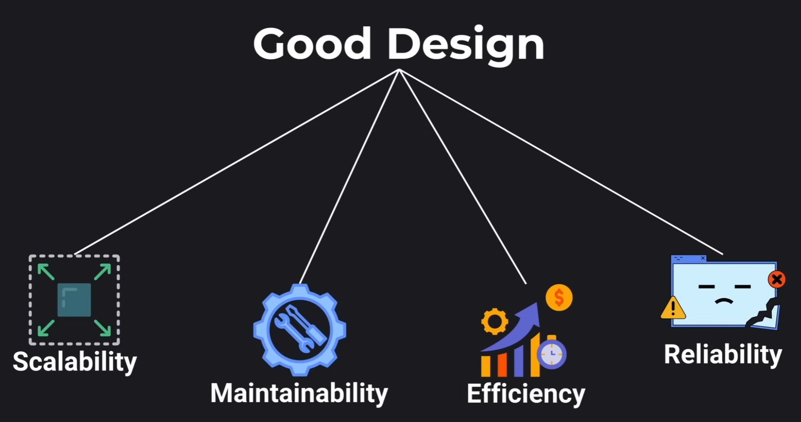
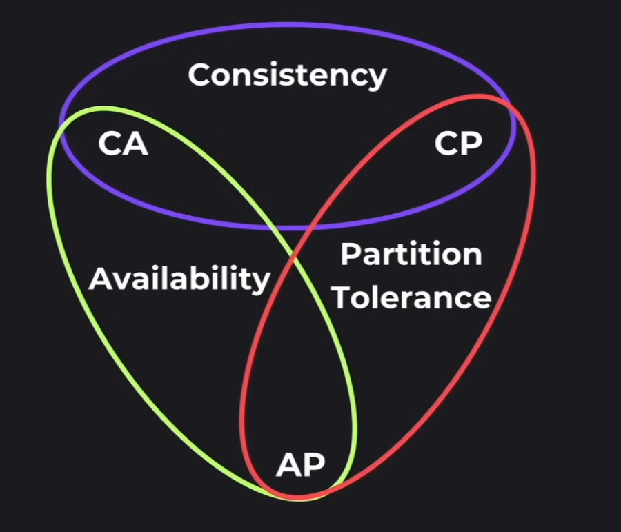
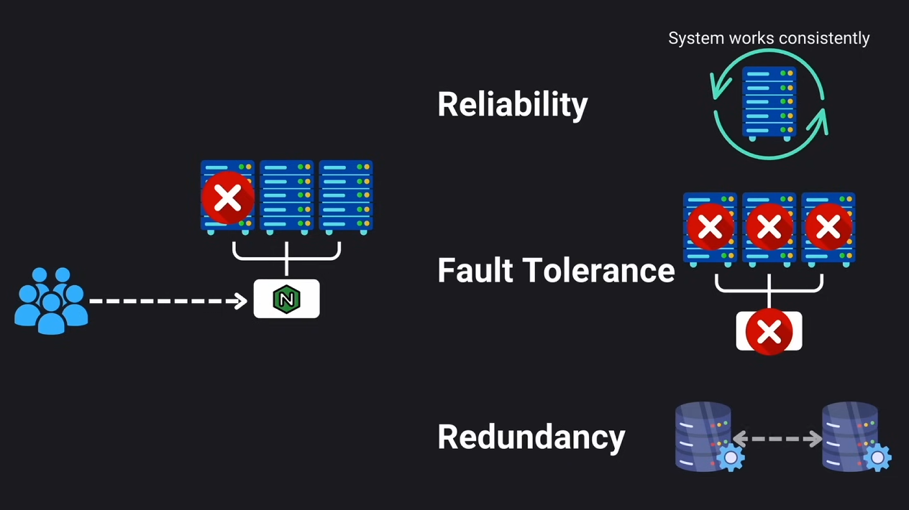
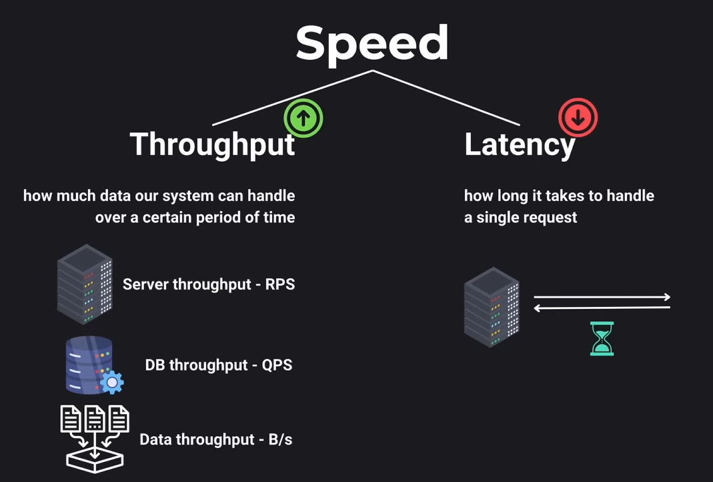

# Design Requirements

## Contents

- Key system design elements
- CAP Theorem
- SLA and SLO
- How to measure
- Resilience
- Speed

## Key System Design Elements

### Moving Data

- Seemless data flow from one part of our system to another
- i.e. user request to server, data transfer between databases, etc.

### Storing Data

- Storage type
- Access patterns
- Indexing strategies
- Backup solutions
- Security measures
- Data availability

### Transforming Data

- Taking raw data and turning it into meaningful information
- i.e. log aggregation for analysis, converting user input into different format, etc.

## CAP Theorem

Also known as Brewer's theorem, it is a set of principles that guide us in making informed trade-offs in 3 key components of a distributed system:

- Consistency
- Availability
- Partition Tolerance

According to the CAP theorem a distributed system can only achieve 2 out of these properties at the same time.

### Consistency

Ensures that all nodes in a distributed system have the same data at the same time. If you make a change to one node then change should also be reflected in the other nodes.

### Availability

The system is always operational and responsive to requests regardless of what might be happening behind the scenes.

### Partition Tolerance

System's ability to continue functioning even when a network partition occurs.

## SLO and SLA

### Service Level Objectives

- **Measured in uptime**
- Sets goals for our system's performance.
- i.e. 300ms response time for 99.9% of the time

### Service Level Agreement

- **Measured in downtime**
- Formal contracts with user/customers. They define the minimum level of service we are commited to provide.
- If we drop below the commited level we might need to provide refunds or some kind of compensation to our customers.
- i.e. 99.99% availability

## Resilience

Expect the unexpected.
To measure this aspect we use:

- Reliability: ensure the system works correctly and consistently
- Fault Tolerance: preparing for when things go wrong and how our system deals with unexpected failures
- Redundancy: if our system fails, there is another "backup" ready to take its place

