# Load Balancing

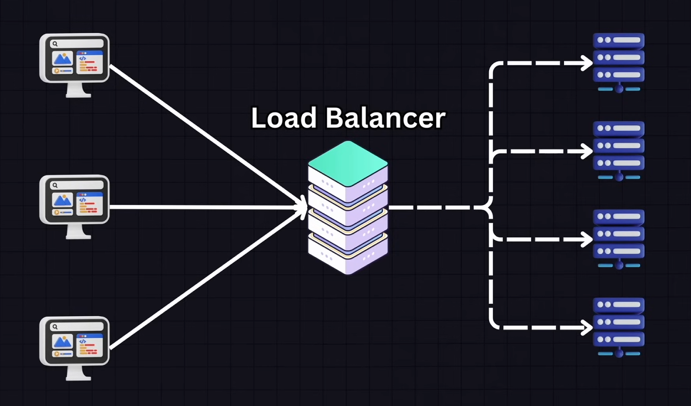

## Content

- Common strategies and algorithms
- Health Checks
- Types of Load Balancers
- Redundancy

## Common Strategies

### Round Robin

Each server in the pool gets a request in sequential rotating order.

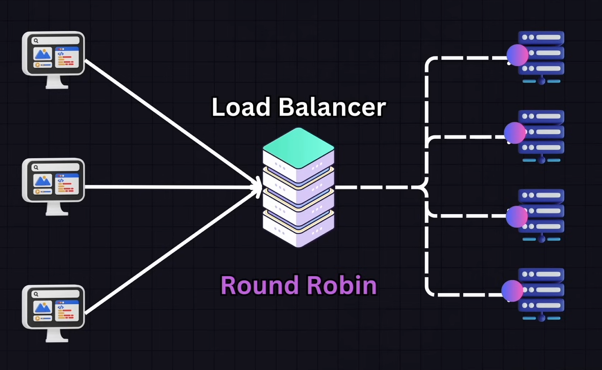

### Least Connections

Directs traffic to the server with the fewest active connections. Ideal for longer tasks or when the server load is not evenly distributed

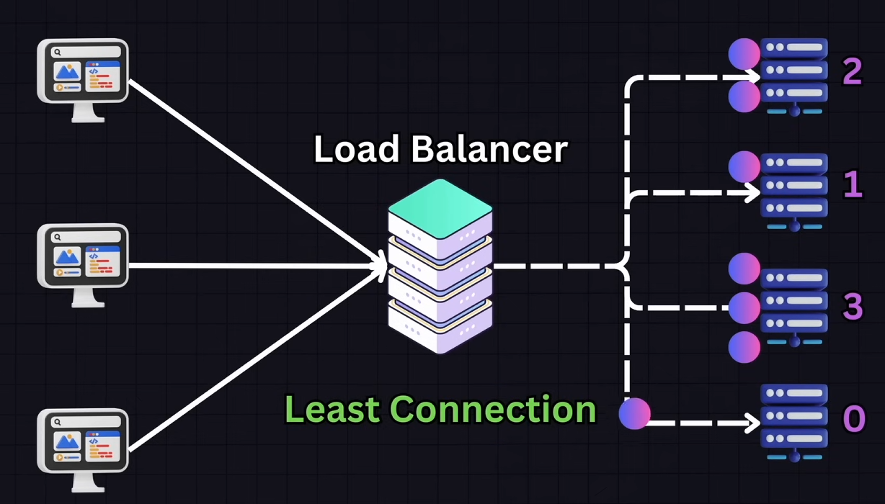

### Least Response Time

Chooses the server with the lowest response time and fewest active connections.

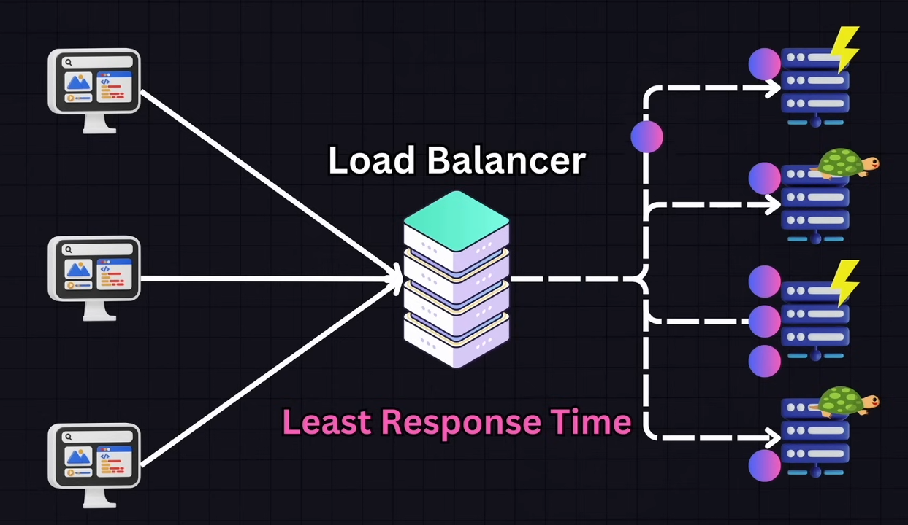

### IP Hash

Determines which server recieves the request based on the hash of the client's IP address. This ensures the client consistently connects to the same server and is useful for session persistence in applications where it is important for the client to connect to the same server.

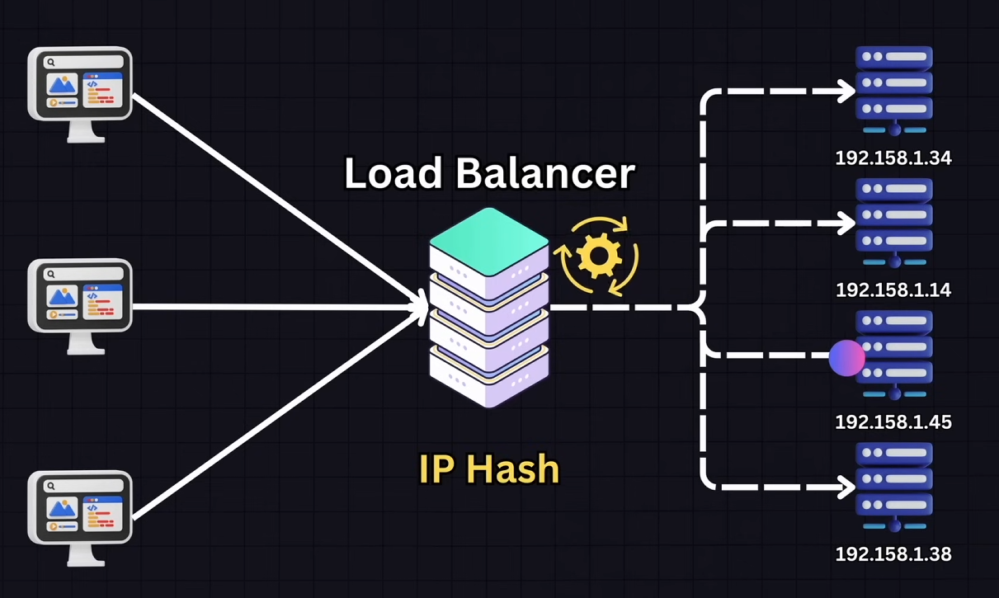

### Weighted Round Robin / Weighted List Connections

Servers are assigned weights typically based on their capacity or performance metrics. Servers wich are more capable handle the most requests.
This is effective if the servers in the pool have different capabilities.

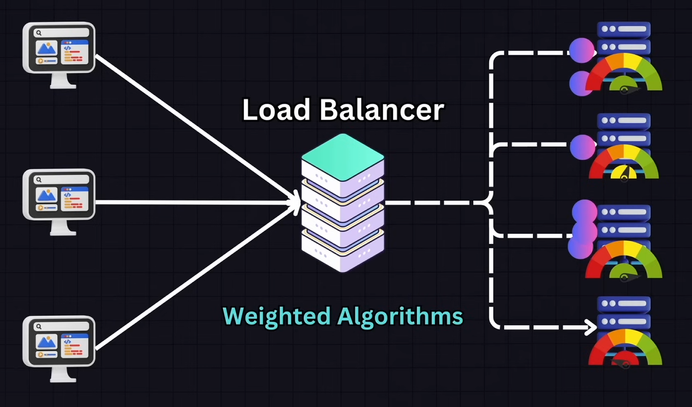

### Geographic

Directs requests geographically closest to the user or based on regional requirements. Useful for global services where latency reduction is priority.

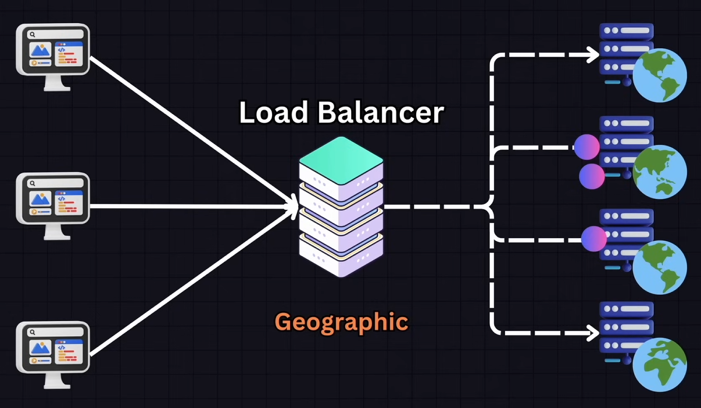

### Consistent Hashing

Uses a hash function to distribute data across various nodes.

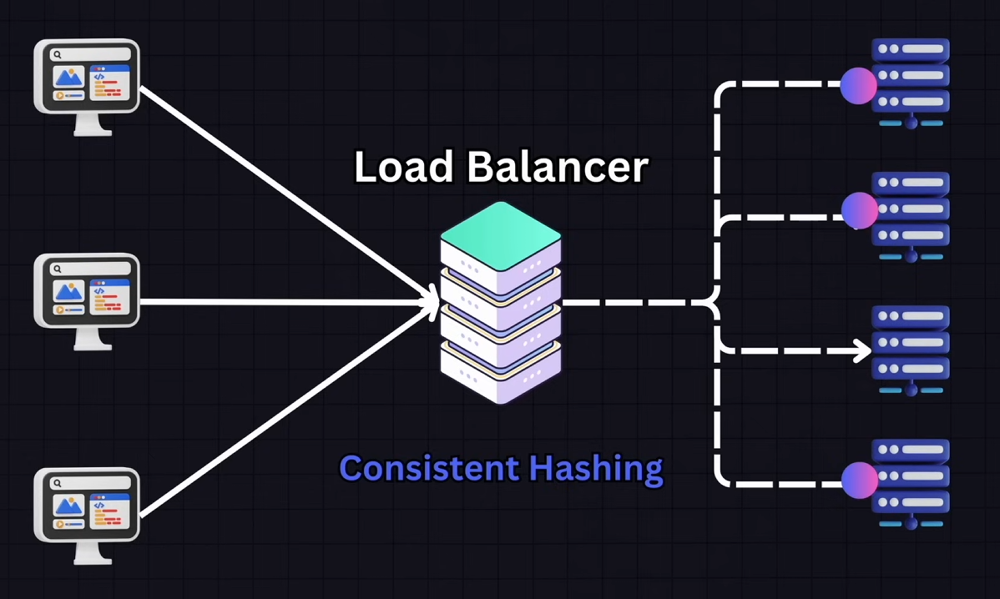

## Health Checks

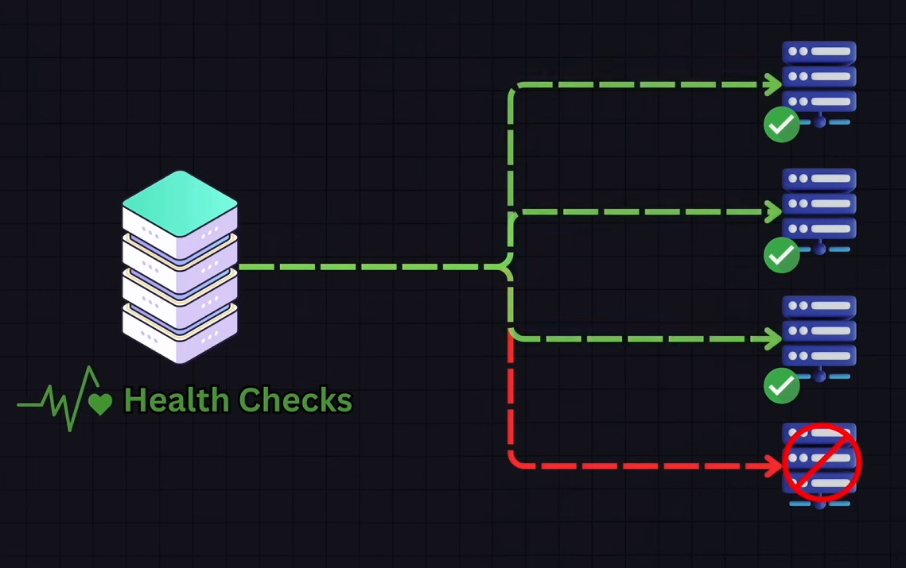

## Types of Load Balancers

- `Hardware Load Balancers`: local traffic management, global server load balancing, application security, content switching and application acceleration.
- `Software Load Balancers`: provides pretty much the same features than a hardware one without the need of a dedicating load balancing device.
- `Cloud-based Load Balancers`: products offered commonly by CSPs.

## Redundancy

### Multiple instances

A common approach is to have more than one load balancer.
If one fails the other one takes over which is a method known as a **`FAILOVER`**

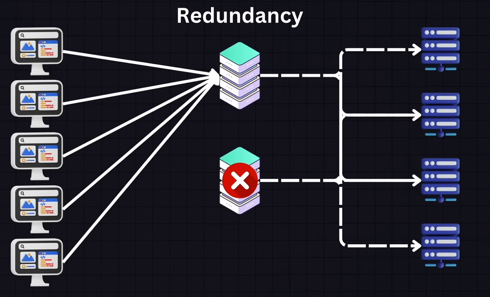

### Health-checks and monitoring

Continuously monitor and do health checks so that any issues can be detected early and can be addressed before causing significant disruption

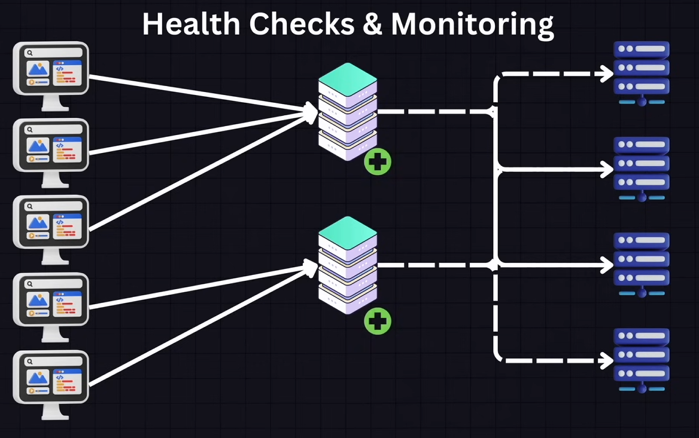

### Auto-scaling and Self-healing Systems

Some modern infrastructures are designed to automatically detect a load balancer failure and replace it with a new instance without manual intervention.

### DNS Failover

In some configurations DNS Failover can re-route traffic away from a load balancer no longer accepting connections to a pre-configured standby IP which is our new load balancer.
