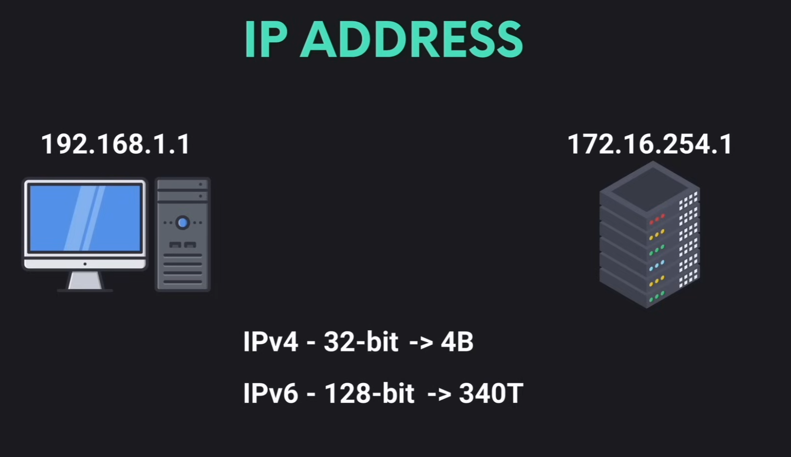
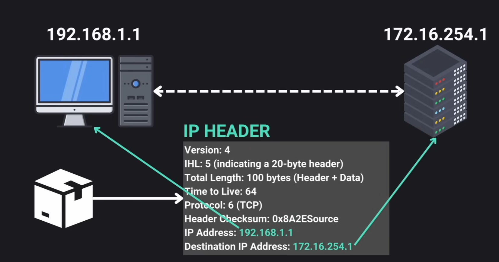
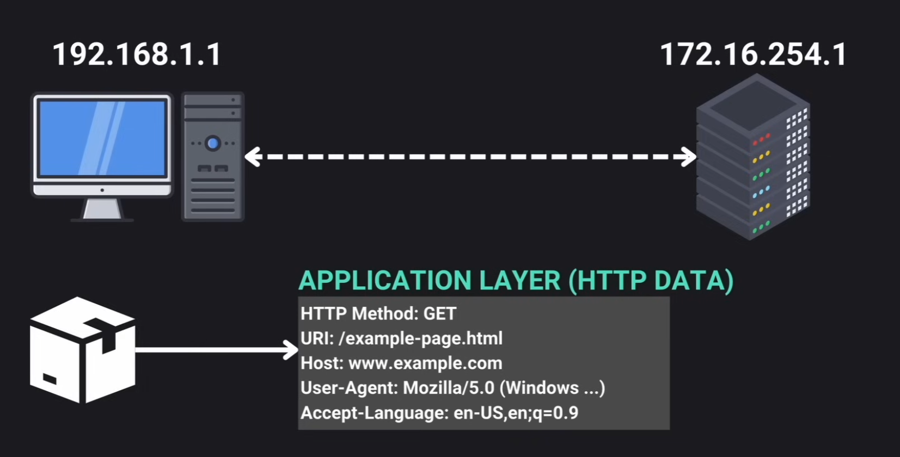
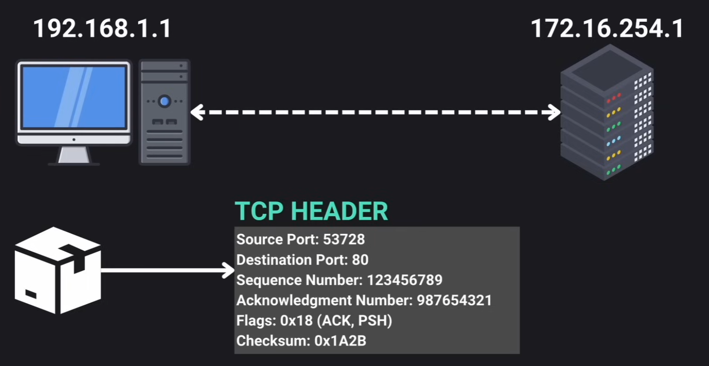
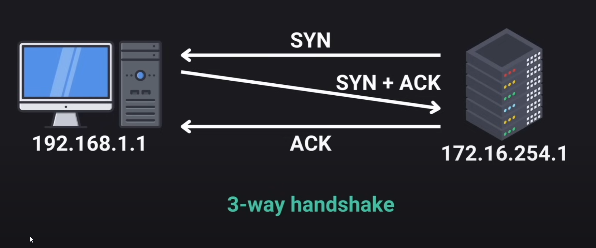

# Networking

For a more in-depth version you can see [ccna-notes](https://github.com/laaraujo/ccna-notes)

## Contents

- IP Addresses
- Internet Protocol
- Transport Layer

## IP Address

A unique identifier for each device in a network.

- `IPv4` addresses are 32bit
- `IPv6` addresses are 128bit significally increasing the number of available IP addresses

## Internet Protocol

Set of rules that define how data is sent and received

## Application Layer

In this layer data specific to application protocol is stored.

## Transport Layer

### TCP

Transmission Control Protocol ensures complete and correct delivery of data packets. It implements a process known as `3-way handshake`.

### UDP

User Datagram Protocol is faster but less reliable than TCP.
It doesn't stablish a connection before sending data and doesn't guarantee the delivery or order of the packages.
Usually used for time-sensitive communications like video-calls or live-streaming where speed is crucial and some data loss is acceptable.

## DNS

Domain Name System translates human-friendly domain names into IP addresses, allowing users to stablish a connection to the server and retrieve the web resource.

- `A Record`: Maps the domain to the corresponding IPv4 Address
- `AAAA Record`: Maps the domain to the corresponding IPv6 Address

### ICANN

Coordinates the global IP address space and DNS. Domain name registrars are accredited by ICANN to sell domain names to the public.
