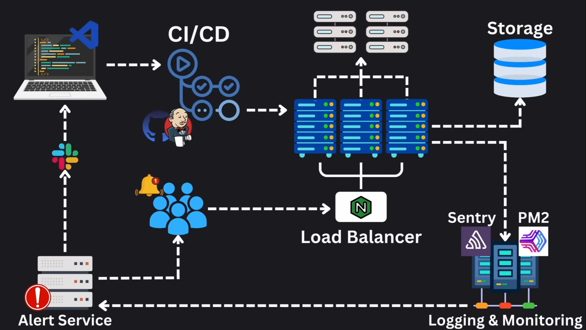
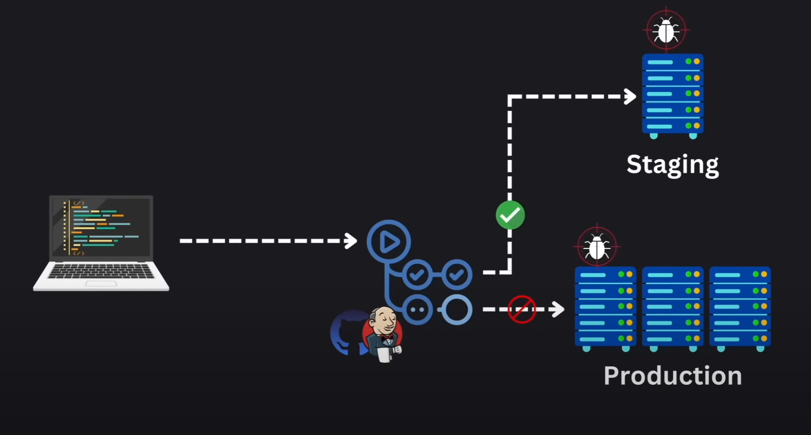

# Production Application Architecture

## Contents

- [CI/CD Pipeline](#cicd-pipeline)
- [Load Balancers](#load-balancers)
- [External Storage](#external-storage)
- [Logging and Monitoring](#logging-and-monitoring)
- [Alerting](#alerting)
- [Safe Environments](#safe-environments)

## CI/CD Pipeline

Continuous Integration and Continuous Deployment

- Ensures our code goes from the repository (i.e. version control) through a series of tests and pipeline checks to a production environment without manual intervention.
- i.e. Github Actions, Jenkins, etc.

## Load Balancers

- Allows us to evenly distribute user requests across multiple servers
- i.e. Nginx, Traefik, Caddy, etc.

## External Storage

- Running in a different server, connected over a network
- i.e. PostgresQL, MySQL, MongoDB, S3, Cloud Storage, etc.

## Logging and Monitoring

- Keeps and eye on every microinteraction and/or store logs for analysis
- It is standard practice to store logs on external services, outside of our primary production server
- i.e. Sentry, Prometheus, Kibana, etc.

## Alerting

- Typically connected to our logging/monitoring systems
- Alerts us and/or users about issues, errors, etc.

## Safe Environments

- **If possible**; never debug or test directly in production environments
- We typically have a development/staging environment to test code or debug production issues.
